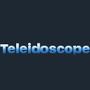

# Teleidoscope


---

**Teleidoscope** is a free and open-source utility mod for Minecraft that lets host players seamlessly open their singleplayer worlds to their friends through the [Steam Networking API](https://partner.steamgames.com/doc/features/multiplayer/networking).

By replacing traditional LAN setups with Steam's robust Peer-to-Peer (P2P) networking infrastructure and Steam Datagram Relay (SDR), Teleidoscope enables direct, low-latency connections. It completely bypasses complicated port forwarding, third-party hosting, and the inconveniences of other mods like [e4mc](https://modrinth.com/mod/e4mc) (entering a new IP every session) or Essential (bloated with ads and microtransactions). Plus I mean, come on, who doesn't have Steam installed in this day and age?

⚠️ **Status Notice:** Teleidoscope is currently under active development. Bugs, connection edge cases, or crashes may occur. Feature requests are welcome, but development is primarily focused on connection stability, cross-platform compatibility, multi-loader support, and bug fixes.

---

## 🔽 Installation

> **NOTE:** The mod is still under development and no stable builds have been released yet. Check back later!

---

## 🐛 Reporting Issues

If you encounter bugs, crashes, or connection drops, please report them using the [issue tracker](https://github.com/Ayydxn/Teleidoscope/issues).

Before opening a new issue:
* Use the search bar to check if your issue has already been reported.
* Ensure you include your mod loader, Minecraft version, operating system, and relevant log files (`latest.log` or crash reports).

Duplicate issues or those missing the required diagnostic logs may be closed.

---

## 🛠 Building From Source

Teleidoscope uses a standard Gradle multi-project setup via Architectury. You can build artifacts for all supported mod loaders by executing the default Gradle `build` task:

```bash
./gradlew build
```

Once the build completes, the compiled `.jar` files will be located in the following folders:

* **Specific Loader / Common JARs:** Inside the `build/libs` folder of that module's directory (For example, `fabric/build/libs` or `common/build/libs`).
* **Universal Multi-Loader JAR:** Inside the root `build/forgix` directory. (If absent, run the `mergeJars` task from Forgix)

---

## 📜 License

Teleidoscope is licensed under the free and open-source license, GNU LGPLv3. For more information, please read the [license](https://choosealicense.com/licenses/lgpl-3.0/).
